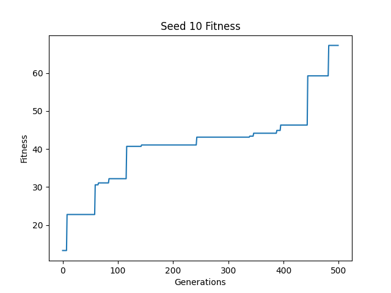

# Final Project

This project is an assignment for a course at Northwestern University, [CS 396 Artificial Life](https://www.mccormick.northwestern.edu/computer-science/academics/courses/descriptions/396-2.html). The assignments are based on [Ludobots](https://www.reddit.com/r/ludobots) and use [pyrosim](https://github.com/jbongard/pyrosim).

## What is this?

This is a simulation of evolved 3D creatures. Creatures start out with a randomly generated body and brain. Then, through an evolutionary algorithm, the creatures bodies and brains slowly evolve to help them move as far as possible.

## Generating bodies

Here is an example of how a body might be generated. Body parts with and without sensors are indicated by green and blue rectangles respectively. The arrows indicate directed edges in the body tree. The red circles indicate joints. Black dotted rectangles indicate potential body part placements, red dotted rectangles indicate invalid body part placements.

All randomly generated bodies consist of anywhere between 5 and 10 body segments. Each body segment is a randomly sized cube, with each dimension ranging from 0.5 to 1.0. Every body starts with a root part, as can be seen above. Then, each successive body part can be attached to any open cube face. Some placements may be invalid if the part intersects with the body, which is shown by the red dotted rectangles in the figure. When a valid placement has been determined, a joint is created to connect the new part to the body. The joint can rotate around the x, y, or z axis. Bodies are represented using a tree. Body parts are vertices in the graph and joints are edges.

## Generating brains

Here are two examples of how a brain might be generated for a particular body. The green squares indicate neurons which are actived by the sensors in the body. The red circles indicate neurons which active the motors in the joints of the body. The arrows indicate synapses between the neurons.

As can be seen in the figure, the shape of the brain is determined by the layout of the body. Each sensor in the body corresponds to an input neuron in the brain and each joint/motor in the body corresponds to an output neuron in the brain. Every input neuron has a synapse connecting it to every output neuron. This means that each sensor can affect every joint in the creature. When the brain is first generated, the weights of each synapse are randomized. Brains are represented as a complete bipartite graph. Sensors and joints are vertices in the graph and synapses are edges.

## Evolution and fitness

Here is an example of evolution. The arrows represent the offspring of a creature. The crosses indicate creatures which were not fit enough to survive. The dotted rectangles indicate creatures which survived their generation. The circled creature represents the most fit creature overall at the end of evolution.

Creatures are evolved using a hill climbing algorithm. This works by isolating populations of creatures. Each creature in every population produces an offspring for the next generation. Offspring are created by imposing a random mutation on the parent. Then, the fitness of the child is evaluated and compared to the parent. The most fit of the two will survive to reproduce for the next generation. At the end of evolution, the last generation consists of the most fit creatures in each population. Then, the populations are compared and the final winner is selected.

In the example from the figure, the creature in generation 1 of population 1 has a fitness of 0.3 and produces a mutated offspring which has a fitness of 0.5. Since the offspring performs better, it will outlive its parent and reproduce to create the next generation. Somewhere between then and generation 10, a new offspring outperforms it, and so on, until the creature in generation 10 of population 1 has a fitness of 13.2.

The fitness function which was used was squared distance from the origin. This rewards creatures that move as far away from their starting point as possible.

## Mutations

Here is an example of some mutations between generations as a population evolves. The dotted shapes indicate components that were added or removed, and the large green arrow indicates a brain weight that was changed.

When a creature produces an offspring, a random mutation is imposed. Mutations can involve either changing the brain or body of a creature. Each time a creature mutates, one of three things may happen:

* With probability 0.25, a creature may lose one of its terminal body parts.
* With probability 0.25, a creature may grow a new terminal body part.
* With probability 0.5, a creature may have a weight changed in its brain.

In the example in the figure, at generation 6 the creature loses a terminal body part. This results in the brain losing two of its neurons, since the body part had a sensor. In generation 34, a new terminal body part is added on. This time the body part does not have a sensor, but a new neuron for the joint needs to be added to the brain. When the synapse connected the new neuron to the brain is created, it has a random weight. Lastly, at generation 92, the weight of a synapse in the brain is increased.

# Results

Comparisons of random, unevolved creatures, and the evolved creatures can be made by running the demo (see [here](#running-the-project)). Creatures were trained using random seeds 1-10, and the highest fitness of each creature was tracked accross generations. Each training session had a population size of 10, generation count of 500, and the creatures were simulated for 2000 time steps.

The creature with the overall highest fitness, is the creature evolved from seed 5. It is the hopping monoped in the gif above.

## Running the project

To see a random creature, run:

`
python demo.py
`

To see the evolved creatures (1-10), run:

`
python demo.py <seed>
`

To train a creature with a specific seed, run:

`
python search.py <seed>
`

Note: this project requires that `python` be available in your path