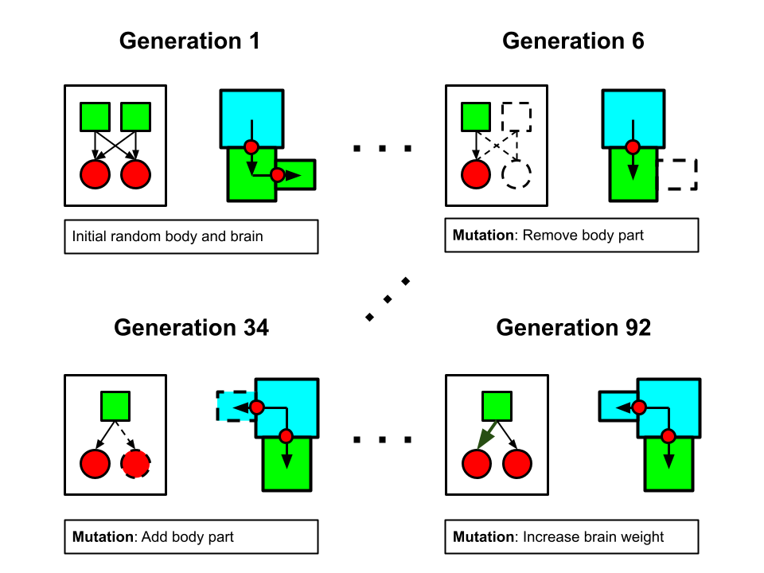
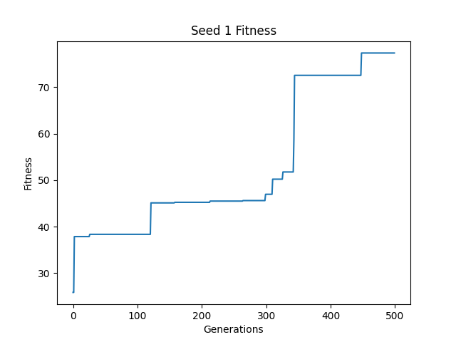
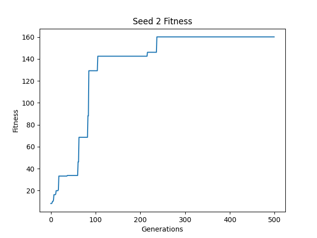
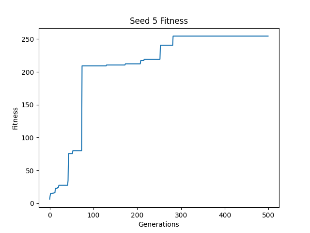

# Assignment 8

This project is an assignment for a course at Northwestern University, [CS 396 Artificial Life](https://www.mccormick.northwestern.edu/computer-science/academics/courses/descriptions/396-2.html). The assignments are based on [Ludobots](https://www.reddit.com/r/ludobots) and use [pyrosim](https://github.com/jbongard/pyrosim).

## What is this?

This is a simulation of evolved 3D creatures. The creatures start with a randomly shaped body with a number of randomly placed sensors which control motors placed at their joints according to random weights in their brain. Then, through an evolutionary algorithm, the creatures bodies and brains slowly evolve to help them move as far as possible.

## Morphospace

Creatures consist of anywhere between 10 to 15 body segments. Each body segment is a cube with each dimension randomly ranging from 0.5 to 1.0. Each successive body part can be attached to any face of the cubes in the already existing body with a joint that rotates around the x, y, or z axis so long as the placement does not cause any self intersections. This allows for an enormously large morphospace with relatively low complexity. One glaring restriction to the morphospace of these creatures is that the joint graph must be a DAG. These creatures are not capable of having cyclic joint connections, which could have opened the door to some really interesting results.

Here is an example of how a creature could be generated. The blue and green squares are body parts and the red arrows show how the body parts are connected by joints.

## Brain

The brain is a matrix of weights connecting the sensors to the joints. Each creature has sensors randomly spread throughout its body. Each sensor affects every joint in the creature. The brain can be represented as a complete bipartite graph of sensors and joints.

Here the yellow circles represent sensors and the red squares represent joints.

## Evolution and fitness

Creatures are evolved using a hill climbing algorithm. Random mutations are imposed on each creature, and their fitness is evaluated to determine which ones perform the best at each generation. The fittest creatures in each generation carry through to the next round, and the process continues. In this particular example, the fitness function used was squared distance from the origin. This encourages creatures to move as far away from the start point as possible during the simulation.

The mutations involve changing the brains and bodies of the creatures. Each time a mutation occurs, one of three things may happen:

* With probability 0.25, a creature may lose one of its terminal body parts.
* With probability 0.25, a creature may grow a new terminal body part.
* With probability 0.5, a creature may have a weight changed in its brain.

Here, the red square represents a body part that has been selected to be removed, and the blue square represents a new body part that has been grown. Note that all changes happen at terminal body parts.

Here, the dotted green arrow represents a weight which has been increased, and the red dotted arrow represents a weight which has been decreased. Note that when a body part is removed, the joint and sensor corresponding to that part are removed from the brain too. When a body part is added, a new joint and sensor are added to the brain with random initial weights.

# Results

A comparison of a random, unevolved creature, and an evolved creature can be seen by running the demo (see [here](#running-the-project)). Creatures were trained using random seeds 1-5, and the highest fitness of each creature was tracked accross generations. Each training session had a population size of 20, generation count of 250, and the creatures were simulated for 2000 time steps.

## Running the project

To see a comparison between unevolved and evolved creatures, run:

`
python demo.py
`

To train a creature with a specific seed, run:

`
python search.py <seed>
`

Note: This project only runs on Windows.